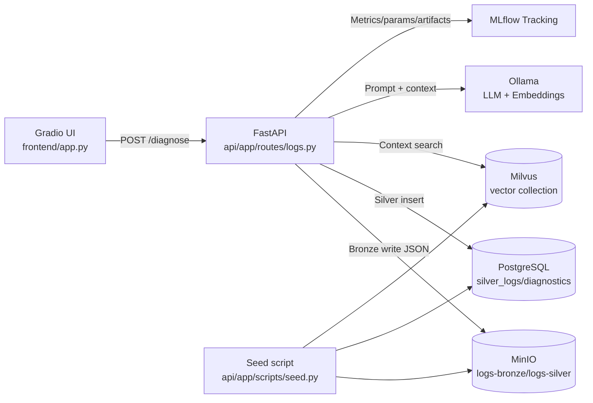
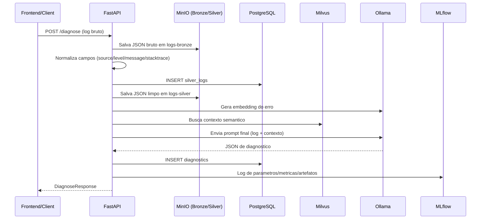

# Arquitetura do Sistema AIOps

Este documento descreve a arquitetura de referencia da Semana 1 do TCC, alinhada ao codigo atual do repositorio.

## Visao de containers e componentes



## Fluxo Medallion (Bronze -> Silver -> Gold)



## Fallback ASCII (caso Mermaid nao renderize)

```text
[Gradio UI] -> [FastAPI]
                |-> [MinIO logs-bronze]
                |-> [PostgreSQL silver_logs]
                |-> [MinIO logs-silver]
                |-> [Ollama embeddings] -> [Milvus context search]
                |-> [Ollama chat diagnosis]
                |-> [PostgreSQL diagnostics]
                |-> [MLflow tracking]
```

## Observacoes tecnicas

- O RAG fica efetivo quando a collection do Milvus estiver populada com documentacao/runbooks.
- A etapa de seed atual cria estrutura base (buckets, tabelas e collection), mas nao injeta conhecimento de dominio automaticamente.
- O endpoint principal para diagnostico e `POST /diagnose`.
